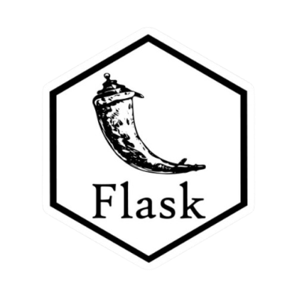
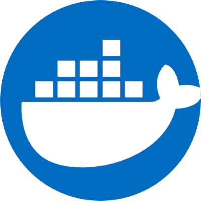

<h1 align="center">Hi 👋, I'm Rudra Prasad Nayak</h1>

> ## 🌟 "Code With Passion - Debug With Patience - Deploy With Pride." 🌟

<table align="right">
    <tbody><tr><td> Languages</td></tr>
    <tr><td><a href="/milaan9/milaan9/blob/main/README.md"> English ★★★☆☆</a></td></tr>
    <tr><td><a href="/milaan9/milaan9/blob/main/README_pt.md"> Hindi ★★★★☆</a></td></tr>
    <tr><td><a href="/milaan9/milaan9/blob/main/README_pt.md"> Odia ★★★★★</a></td></tr>
</tbody></table>

### 🚀 **Open-Source Contributor | Full-Stack Developer | MERN Stack Enthusiast**

👨‍💻 **Who Am I?**

- A passionate **full-stack developer** and **web designer**.
- Pronouns: **He/Him**.

💡 **What I Do?**

- Skilled in **HTML**, **CSS**, **Bootstrap**, **JavaScript**, and **ReactJS**.
- Currently exploring the **MERN Stack** with a focus on **React** and **ExpressJS**.
- Proud **BCA Graduate** from **Berhampur University, Odisha** with additional knowledge from various online courses.

🧠 **Learning & Growth**

- A **Self-Taught Developer** who thrives on learning and improving.

📂 **Projects & Contributions**

- Check out my projects on **[GitHub](https://github.com/rudra420-123/)**.

💬 **Ask Me About:**

- **HTML**, **CSS**, **JavaScript**, **ReactJs**, and **TypeScript**.

🌍 **Community Involvement**

- Always excited about **Open Source Contributions**.

📧 **Get in Touch:**

- **rudraprasadnayak728@gmail.com**

---

# ⚙️ Tech Stack

### 🖥️ **Frontend:** HTML, CSS, JavaScript, ReactJS, TypeScript

### 🔙 **Backend:** NodeJS, ExpressJS, Django, Flask

### 📦 **Frameworks & Libraries:** Bootstrap, Material UI, Tailwind CSS, SCSS, NumPy, Pandas

### 🚀 **Deployment & Tools:** Git & GitHub, Netlify, Heroku, Vercel

### 💻 **Programming Languages:** C, C++, Java, Python, PHP

### 🐧 **Operating Systems:** Android, Windows, Linux

---

# 🌐 Socials

  
  
  
  
  

---

<h2 align="left" id="rudra420-123">🚀 Development-Hub 🚀</h2>

> ## Programming Languages

<table>
  <tr>
    <td align="center" width="96">
      
       C
    </td>
    <td align="center" width="96">
      
       C++
    </td>
    <td align="center"width="96">
      
       Java
    </td>
    <td align="center"width="96">
      
       Python
    </td>
     <td align="center" width="96">
      
       PHP
    </td>
  </tr>
</table>

> ## Frontend Technologies

<table>
  <tr>
    <td align="center" width="96">
      
       HTML
    </td>
    <td align="center" width="96">
      
       CSS
    </td>
    <td align="center" width="96">
      
       JavaScript
    </td>
    <td align="center" width="96">
      
       TypeScript
    </td>
    <td align="center" width="96">
      
       ReactJs
    </td>
  </tr>
</table>

> ## Backend Technologies

<table>
  <tr>
    <td align="center" width="96">
      
       NodeJs
    </td>
    <td align="center" width="96">
      
       ExpressJs
    </td>
    <td align="center" width="96">
      
       Django
    </td>
    <td align="center" width="96">
      
       Flask
    </td>    
  </tr>
</table>

> ## Frameworks and Libraries

<table>
  <tr>
    <td align="center" width="96">
      
       Bootstrap
    </td>
    <td align="center" width="96">
      
       Tailwind CSS
    </td>
    <td align="center" width="96">
      
       SCSS
    </td>
    <td align="center" width="96">
      
       Material Ui
    </td>
    <td align="center" width="96">
      
       NumPy
    </td>
    <td align="center" width="96">
      
       Pandas
    </td>     
  </tr>
</table>

> ## Databases

<table>
  <tr>
    <td align="center" width="96">
      
       SQL
    </td>
    <td align="center" width="96">
      
       MySQL
    </td>
    <td align="center" width="96">
      
       MongoDB
    </td>
    <td align="center" width="96">
      
       PL/SQL
    </td>
  </tr>
</table>

> ## Operating Systems

<table>
  <tr>
  <td align="center" width="96">
      
       Android
    </td>
    <td align="center" width="96">
      
       Windows
    </td>
    <td align="center" width="96">
      
       Linux
    </td>
    <!-- <td align="center" width="96">
      
       Chrome
    </td> -->
    </tr>
</table>

> ## Softwares and Tools

<table>
  <tr>  
    <td align="center" width="96">
      
       Visual Studio Code
    </td> 
    <td align="center" width="96">
      
       PyCharm IDE
    </td>
    <td align="center" width="96">
      
       PyScripter
    </td>
    <td align="center" width="96">
      
       Jupyter Notebook
    </td>
      <td align="center" width="96">
      
       Postman
    </td>
    <td align="center" width="96">
      
       Sublime
    </td>
    <td align="center" width="96">
      
       Cursor
    </td>
    <td align="center" width="96">
      
       Docker
    </td>
    </tr>
</table>

> ## Deployment Tools

<table>
  <tr>
    <td align="center" width="96">
      
       Git
    </td>
    <td align="center" width="96">
      
       GitHub
    </td>
    <td align="center" width="96">
      
       Netlify
    </td>
    <td align="center" width="96">
      
       Heroku
    </td>
    <td align="center" width="96">
      
       Vercel
    </td>
  </tr>
</table>

> ## Designing Tools

<table>
  <tr>
    <td align="center" width="96">
      
       Figma
    </td>
    <td align="center" width="96">
      
       Canva
    </td>
    <td align="center" width="96">
      
       Photoshop
    </td>
    <td align="center" width="96">
      
       Wordpress
    </td>
  </tr>
</table>

> ## Command Line & Scripting

<table>
  <tr>
    <td align="center" width="96">
      
       CMD
    </td>
    <td align="center" width="96">
      
       Bash
    </td>
    <td align="center" width="96">
      
       Powershell
    </td>
    <td align="center" width="96">
      
       Markdown
    </td>
    </tr>
</table>

  <h1 align="center">Summary Of My Github Status</h1>

  
 

  

<table align="center" border="1">
<tr align="center">
<td colspan="3"></td>
</tr>
<tr align="center">
<td></td>
<td></td>
<td colspan="3"></td>
</tr>
<tr align="center">
<td colspan="3"></td>
</tr>
</table>
